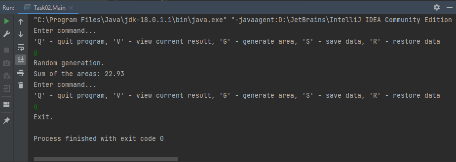
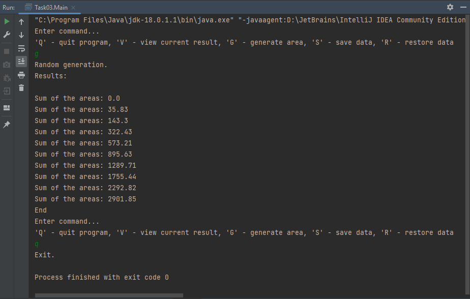
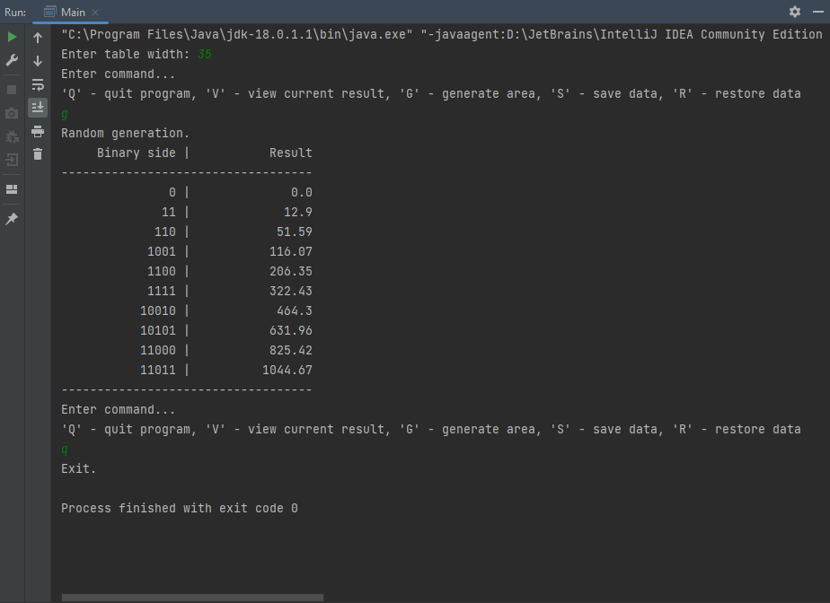
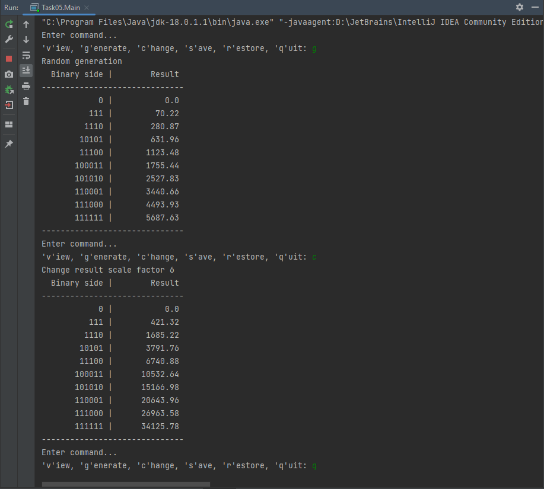

# Добровольський Євгеній, 35 група

## Завдання 1:
Підготовлено репозиторій до розміщення проектів та написана проста консольна програма

## Завдання 2:
Реалізоване завдання варіанта №4, розроблено декілька класів для демонстрації роботи в діалоговому вікні, серіалізації та десереалізацією. Написані javadoc коментарі.
Опис головних класів програми:
- Area - реалізація індивідуального завдання
- Calc - сереалізація, десереалізація та взяємодія з класом Area
- Main - реалізація користувацького інтерфейсу

**Робота програми:**

## Завдання 3:
Створено інтерфейс View, його клас-реалізацію ViewResult, інтерфейс Viewable та клас ViewableResult. Додано можливість задання масиву даних, з певною кількістю елементів. Головний функціонал з попереднього завдання, сереалізація та десереалізація не змінилися, проте операції тепер проводяться над масивом даних

**Робота програми:**

## Завдання 4:
Додано клас ViewTable, що є нащадком ViewResult, та використувується замість нього в класі Main задля виведення даних у вигляді таблиці, розмір якої користувач може налаштовувати самостійно. Використано перевантаження класу, перевизначення класу та динамічне призначення методів.

**Робота програми:**

## Завдання 5:
Додано інтерфейси Command та ConsoleCommand, на їх основі реалізовані класи взяємодії користувача з програмою, меню якої теж виокремлено у власний клас, все це дозволило зробити програму більш розширюваною та зрозумілою для майбутніх розробників

**Робота програми:**
